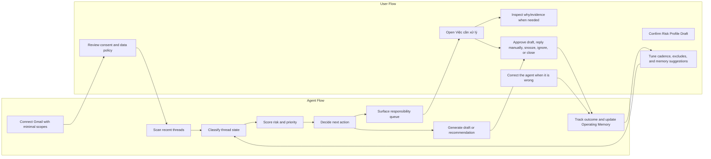
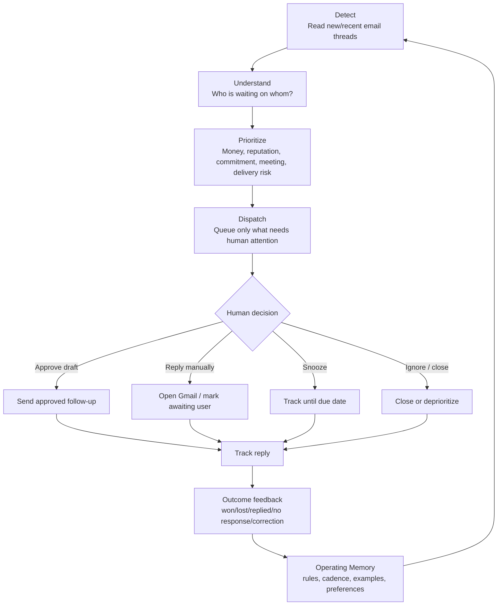
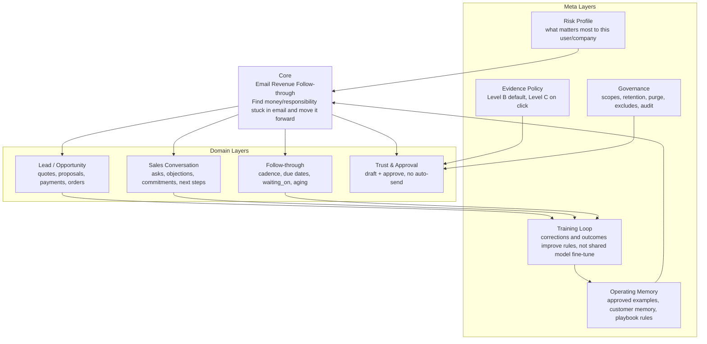
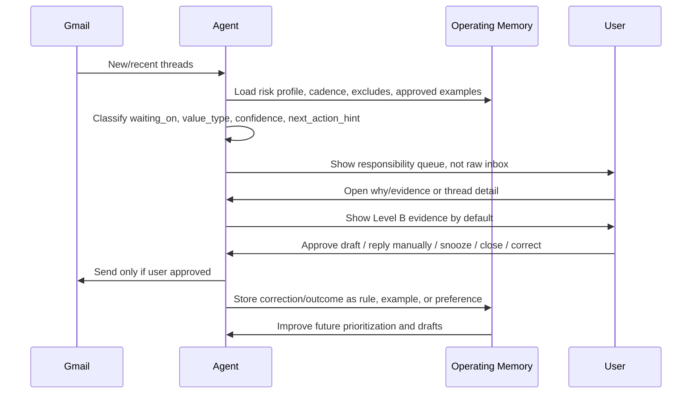
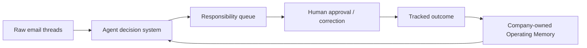

# ws-agent-email

Email Agent workspace for exploring a **responsibility queue**: an agent that reads email threads, detects follow-up risk, drafts replies, and keeps humans in approval/control.

The repo is a design/prototype artifact, not a production app contract. It keeps product docs, a static mockup source, and a throwaway Vite prototype that can be deployed on Vercel.

## Live URLs

- App root: <https://ws-agent-email.vercel.app>
- Mockup source viewer: <https://ws-agent-email.vercel.app/mockups.html>
- Prototype: <https://ws-agent-email.vercel.app/prototype.html>
- Mockup data: <https://ws-agent-email.vercel.app/mockups.data.js>

## What this is

Core product idea: **Email Revenue Follow-through / Responsibility Queue**.

Instead of showing a raw inbox, the agent turns email into a short list of decisions/actions:

- Which email has money, reputation, commitment, meeting, or delivery risk?
- Who is waiting on whom?
- What thread needs human action today?
- What can be safely ignored, snoozed, closed, or monitored?
- What draft is ready for human approval?

Important guardrail: **draft + approve, not auto-send**.


## System maps

### Agent Flow → User Flow



### Core Loop

The product is not an inbox UI. The core loop is: **detect responsibility → reduce to decisions → get human approval → track outcome → learn safer operating rules**.



### Core vs Meta Layers

The core is the thing the user hires the agent to do. Meta layers are the control systems that make the agent trustworthy, useful, and company-owned over time.



### How Core and Meta work together



## Product model in one line



## Source of truth order

When changing UX/content, follow this order:

1. `mockups.data.js` / `mockups.html` — primary screen/state source for visual review.
2. `screens-brief.md` — screen requirements and required states/CTA.
3. Product/domain docs — context and rationale.
4. `prototype/` — throwaway implementation after mockup states are correct.

Do **not** invent onboarding or decision flow directly in the prototype if the mockup/brief already defines it.

## Key files

| Path | Purpose |
| --- | --- |
| `00-START-HERE.md` | Entry point / how to read the workspace. |
| `01-PRODUCT-MAP.md` | Product map and framing. |
| `Agent-Domain-Spec.md` | Domain model, agent behavior, decision system. |
| `screens-brief.md` | Required screens, states, CTA, and interaction brief. |
| `mockups.html` | Static renderer/shell for the mockup. Content should not be inlined here. |
| `mockups.data.js` | Mockup content/state source via `window.WIREFRAME`. |
| `design-system-tokens.css` | OpenClaw-style design tokens used by mockup/prototype. |
| `prototype/` | Vite prototype source. |
| `prototype.html` | Built prototype entry deployed at `/prototype.html`. |
| `prototype-assets/` | Built prototype assets. |
| `appendix/` | Research, target user, MVP/core-loop, dossier, supporting docs. |

## Mockup states currently covered

The mockup data is organized under `window.WIREFRAME.screens`.

### S1 — Kết nối Gmail

Must show onboarding/consent before any queue:

- `first` — first-run connect screen.
- `loading` — OAuth + “quét lịch sử & học giọng”.
- `error` — missing Gmail scope / permission problem.
- `done` — connected handoff.

Required policy copy:

- minimal Gmail scopes,
- reads email to perform the task,
- drafts require approval,
- does not auto-send,
- does not train/fine-tune shared models,
- 90-day retention,
- purge on disconnect.

### S2 — Việc cần xử lý

Responsibility queue / command center:

- `done` — 80 emails processed → 9 decisions left.
- `why` — “Vì sao nổi?” evidence view.
- `memory` — Operating Memory suggestion present.
- `allSafe` — no urgent actions.
- `firstRun` — first queue build.
- `loading` — classification/dispatch in progress.
- `error` — Gmail scan failure.

Key buckets:

- Mail bị trả lại.
- Cần bạn trả lời.
- Đã có reply.
- Cần follow-up.
- Có thể bỏ qua / deprioritized threads.

### S3 — Soạn follow-up

Thread detail / draft / closure actions:

- `draft` — draft ready with guardrails.
- `draftGenerating` — draft regeneration, send locked.
- `needsReply` — human must reply manually.
- `confirmClose` — agent proposes close, human confirms.
- `bounced` — delivery failure / pipeline blocked.
- `loading` — generating summary + draft.
- `error` — send/draft failure.
- `done` — follow-up sent and tracking resumes.

### S4 — Cài đặt nhắc

Cadence, excludes, operating memory, risk profile:

- `settings` — cadence + excludes + delete learned voice data.
- `memory` — Risk Profile Draft and Operating Memory suggestions.
- `deepEvidence` — full evidence drill-down, only after click.
- `empty` — no excludes yet.
- `saved` — settings/profile saved.
- `error` — save failure.

## Evidence / privacy rule

Default evidence should be **Level B**:

- pattern,
- lightly masked subject/snippet,
- high-level signals.

Full thread / deeper evidence is **Level C** and should only appear when the user explicitly clicks deeper evidence. The default UI should not feel like it exposes the entire inbox.

## Prototype rules

The prototype is intentionally disposable.

- Static only.
- No backend.
- No auth.
- No database.
- No production frontend contract.
- Build output must stay deployable as:
  - `prototype.html`
  - `prototype-assets/`

Prototype UI should import/follow `design-system-tokens.css` and use `--cw-*` tokens where applicable.

## Local workflow

Review mockup:

```bash
# Open mockups.html in a browser, or use the deployed URL.
# Content comes from mockups.data.js via window.WIREFRAME.
```

Check mockup syntax:

```bash
node --check mockups.data.js
```

Build prototype:

```bash
cd prototype
npm install
npm run build
```

The Vite config is expected to emit static assets back to the repo root as `prototype.html` and `prototype-assets/`.

## Deployment

The repo is connected to Vercel. Pushing to `main` deploys the static files.

Before pushing, verify:

```bash
git status --short --branch
node --check mockups.data.js
```

If prototype files changed, also verify the Vite build.
